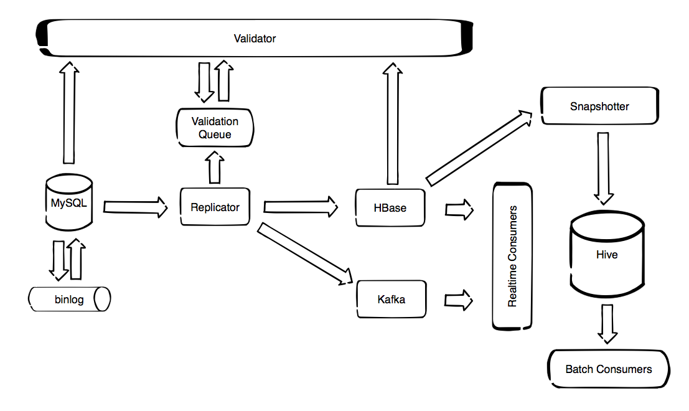
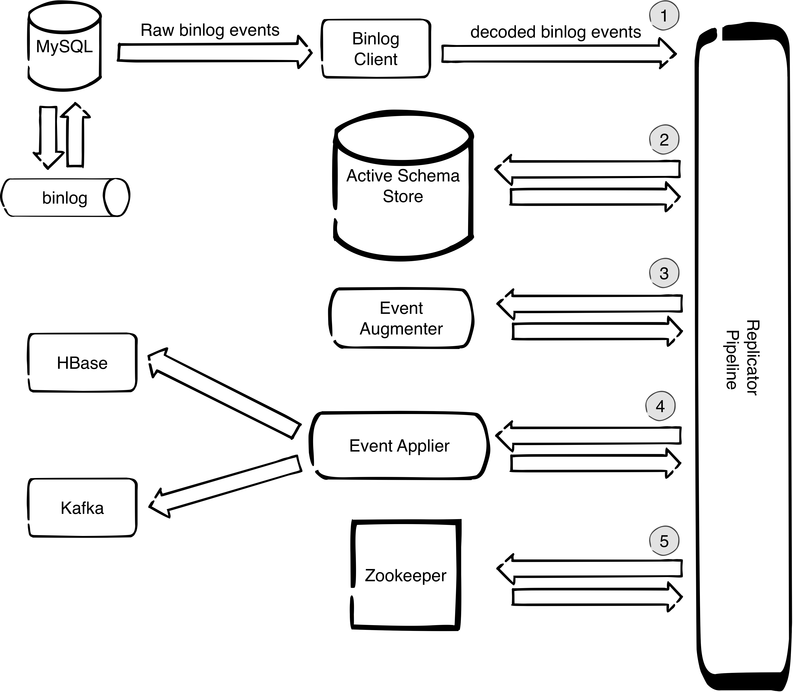

# Welcome to MySQL Time Machine
MySQL Time Machine is a collection of services and tools for creating, processing and storing streams of MySQL data changes. Its main components are presented bellow.

## Replicator
Replicates data changes from MySQL binlog to HBase or Kafka. In case of HBase it preserves the previous data versions. HBase version is intended for auditing of historical data. In addition can maintain special daily-changes tables which are convenient for fast and cheap imports from HBase to Hive. Kafka version is intended for processing data change streams in real time.

The components of the replicator are presented at the diagram bellow:

The numbers on the diagram mark the main tasks that the replicator does in order to reliably decode, decorate and deliver data change events to the designated target store:

1. It uses binlog client (OpenReplicator) which is decoding binary stream to a stream of java objects that can be further processed by the replicator pipeline.

2. It keeps track of schema changes that are happening and makes sure that the schema that is used to decorate events always corresponds to the position of the event in the binlog. This is important since if we were to just query the MySQL slave information_schema we do not have guarantee that the schema matches the schema of the event in the binlog. The way this is implemented is by having a shadow schema which only contains the schema and not the data. Whenever we have a DDL statement in the binlog we apply that statement to the shadow schema. We call this schema 'Active Schema' because its state always corresponds to the
position of the event that was last processed, so it is always correct. The active schema is stored on a separate MySQL instance because that is a safe alternative to implementing a MySQL parser because MySQL always knows how to parse MySQL so there is no possibility of errors due to corner cases in syntax.

3. It decorates events with complete schema information even the information that
is not present in binlog TABLE_MAP event (like if the number is unsigned). This is possible because we do not use TABLE_MAP event but instead we use the active schema from point 2.

4. It applies the schema-decorated events to the designated target. In case of HBase the applier is parallelized so ingestion rate can be very high - everything that can be pulled from MySQL can be written without replication delay.

5. It maintains safe check points in zookeeper which enable the failover mechanisms for high-availability setups, both for MySQL server failover and replicator instance failover.

## Binlog Flusher
In case we want to have the initial copy of the database in Kafka or HBase, before we start to replicate changes, we can achieve that by stoping the MySQL slave, flushing the database to the binlog and turning MySQL slave on again. This is the purpose of Binlog Flusher tool. It Flushes MySQL database tables to the binlog in order to have the initial snapshot of the database in the binlog.

## HBase Snapshotter
In case of replication to HBase, we can use the fact that HBase is temporal database which supports versioning. By default we keep 1000 versions. This means that for every field in MySQL table, on the HBase side we have all versions (with appropriate timestamps) since the replication has started. However, if we want to see how a given table looked at specific point in time, we can scan the HBase table and filter the timestamps, get the versions that correspond to desired point in time and store it in a Hive table. This is the purpose of HBaseSnapshotter.

HBaseSnapshotter is a Spark application that takes a snapshot of a HBase table at a given point in time and stores it to a Hive table. This can not be done just by using HBase storage engine for Hive since it only works with the latest version. Spark does not have such limitations so it was used to make the snapshotter.

## Validator
Validates the replicator correctness.
