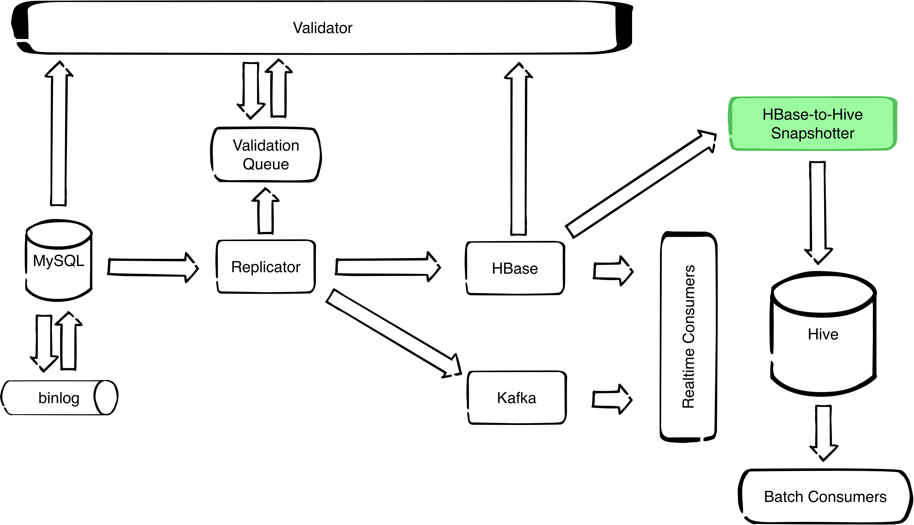

### Overview
HBaseSnapshotter is a Spark application that takes a snapshot of an HBase table at a given point in time and stores it to a Hive table.



Currently there are two other solutions doing similar work, but not the exact functionality.

1. HBase allows you to take a snapshot from an HBase table to another HBase table by using the provided Export and Import tools. This is done by specifying a table name, start time, end time, and number of versions, and running the export tool which will export the table to HDFS in a SequenceFile format. Then you can import the SequenceFile files to a new HBase table by using the import tool. For more information, you can check [this](http://hbase.apache.org/book.html#export).

2. Hive storage handler allows you to use Hive queries and apply Hive operations on an HBase table. The shortcoming of this method is that it's able to access only the latest version of an HBase table. You can check [this] (https://cwiki.apache.org/confluence/display/Hive/HBaseIntegration) for more information.

HBaseSnapshotter allows you to take a snapshot from an HBase table and save it as a Hive table directly, with the possibility of selecting a desired point in time to copy the table at.

### Configuration
HBaseSnapshotter needs a json configuration file to be provided as a positional argument ```application.json```

The format of the json config should obey one the following schemas
(`HBaseSnapshotter.MySQLSchema` or `HBaseSnapshotter.HBaseSchema`):

    HBaseSnapshotter {
      MySQLSchema {
        mysql.table : "database.Tablename"
        mysql.schema : "namespace:tablename"
        hbase.timestamp : -1
        hbase.zookeeper_quorum : ["hbase-zk1-host", "hbase-zkN-host"]
        hbase.table : "namespace:tablename"
        hive.table : "database.tablename"
      },
      HBaseSchema {
        hbase.timestamp : -1
        hbase.zookeeper_quorum : ["hbase-zk1-host", "hbase-zkN-host"]
        hbase.schema : ["family1:qualifier1:type1", "familyN:qualifierN:typeN"]
        hbase.table : "namespace:tablename"
        hive.table : "database.tablename"
      }
    }

  * `mysql.table`: original replicated MySQL table (`string`)
  * `mysql.schema`: schema change history table in HBase (`string`)
  * `hbase.timestamp`: time before which to snapshot (`number`)
  * `hbase.zookeeper_quorum`: list of HBase zookeeper nodes to establish a connection with an HBase table (`list`)
  * `hbase.table`: replicated table in HBase (`string`)
  * `hbase.schema`: list of columns forming the schema of the source HBase table. A column is formatted as `Familyname:Qualifiername:Typename` (`list`)
  * `hive.table`: destination table for snapshot in Hive (`string`)

For snapshots from MySQL replication chains produced by the [Replicator](https://github.com/mysql-time-machine/replicator), the following is a valid configuration:

    {
        "mysql": {
            "table": "database.Tablename",
            "schema": "schema_history:database"
        },
        "hbase": {
            "timestamp": -1,
            "zookeeper_quorum": ["hbase-zk1-host", "hbase-zkN-host"],
            "table": "namespace:tablename"
        },
        "hive": {
            "table": "database.tablename"
        }
    }

For snapshots from arbitrary HBase tables, the following is a valid configuration:

    {
        "hbase": {
            "timestamp": -1,
            "zookeeper_quorum": ["hbase-zk1-host", "hbase-zkN-host"],
            "schema": ["d:column_a:integer",
                       "d:column_b:string",
                       "d:column_c:double"],
            "table": "namespace:tablename:"
        },
        "hive": {
            "table": "database.tablename"
        }
    }

To write a configuration file, you can start by copying one of the
example files in the `conf` directory and customise it to your own
needs.

### Hive Schema
The resulting Hive table will have the same schema as the source HBase
table (as far as it can infer the original MySQL schema, or as
completely as possible given the `hbase.schema` list. Missing
datatypes will default to `STRING`.  A new column will be added to the
Hive table named `k_hbase_row_key` for storing the HBase key of this
row. For MySQL snapshots, an additional row named
`k_replicator_row_status` will be added to the Hive table, denoting
whether the row resulted from a schema change.

### Usage

    bin/hbase-snapshotter application.conf

### Build
First you need to build a fat jar containing all the dependencies needed by this app. Inside the project's folder, execute the command:

    sbt assembly

If you don't have sbt-assembly installed, take a look at this https://github.com/sbt/sbt-assembly. This will build a fat jar at this path:

    target/scala-2.10/HBaseSnapshotter-assembly-2.0.jar

You can then copy this jar along with the files hbase-snapshotter and application.json to a docker container or a hadoop box supporting Spark:

    scp target/scala-2.10/HBaseSnapshotter-assembly-2.0.jar hadoop-box.example.com:~
    scp hbase-snapshotter hadoop-box.example.com:~
    scp application.json hadoop-box.example.com:~

Replace hadoop-box.example.com by the actual name of your hadoop box.

Provide your config settings in the file `application.json`.

Finally, from the docker or hadoop box, you can run the spark app via the bash script

    bin/hbase-snapshotter application.json
